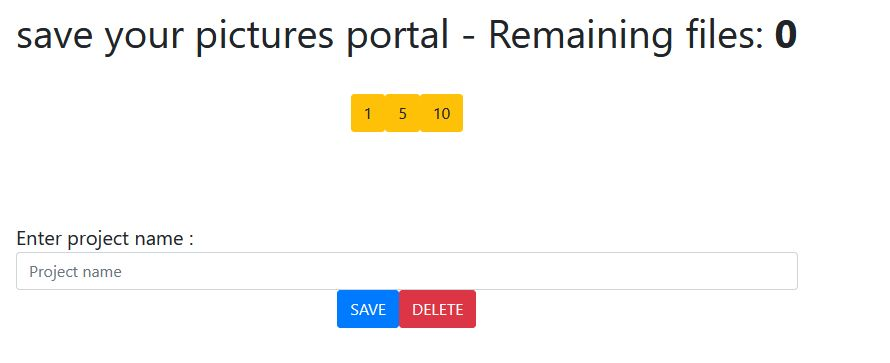

# The Mumps Framework
(c) 2018 eli smadar yaweli@gmail.com

mFrame project include a full mumps framework running on any linux including Raspberry pi
and can be accessed by the browser (desktop or mobile) 
it's a platform to develop a web apps / desktop apps and websites with mumps as a code 
that will generate nice web ui using latest bootstap.

Also can be run as framework on a docker , or on any Linux machine , laptop or on a cloud.

The only framework in the world including nativly : 
1. Database
2. Programming languge
3. UI
4. Web enable and scaleable

All edited in one source file style html 


### Features
#### mumps extension commands
####   a. FOR-IN loop
      instead of those line:
```
      N I
      S I=""
      F  S I=$O(^MYGLO(V1,V2,V3,I)) Q:I=""  D SOMTHING(I)
      Q
    SOMTHING(I) ;
      : 
      Q
```

just use this:
```
      FOR I IN ^MYGLO(V1,V2,V3) D SOMETHING(I)
```
This new smart for loop can work on locals and on globals with any variations including indirection like this :
```
      FOR J IN @GLO D IT
```
####    b. #INCLUDE routineName
This will merge the routineName into my routine, 
you can find this useful when writing tools , and need to access a lot of labels of the tool during the entire routine , so including it will a) keep its current version and b) will let you reference the labels without label^routine - just the "label" which make a routine more clean. 
       

[Learn more](mext.md)

## the framework
html + mumps - one place development of your application

#### exmaple 1 - simple html
A mix of an html page +  javascript + a mumps code , which will run during the load of the page
```html
<h2> Hello world </h2>
<3> multiplication table </h3>
<hr>
<m>
START	;
	W !,"DATE: ",$H,!
	W !,"<div class=card>"
	W !,"<div class=card-body>"
	F LIN=1:1:10 W "<BR>" F ROW=1:1:10 W " ",ROW*LIN
	W !,"</div>"
	W !,"</div>"
  Q   
</m>  
```
result: 


#### exmaple 2 - interact with forms
Using forms and input elements is now simple. 
To check the field on the server side just use mLabel(label,this) and the Framework will do
the check on your server side label^routine, to reject the input just use D ALERT("message").

```html
	<form>
		enter number: <input id=id100 type="text" value=80 name=var1 onChange="mLabel('CHECKN',this)" /> <br/>
		enter number: <input id=id101 type="text" value=80 name=var2 /> <br/>
		enter name: <input id=id102 type="text" value=80 name=name1 /> <br/>
	</form>
<m>
START ;
   Q
CHECKN ;
	I M>100 D ALERT("BIG"),FOCUS("id100")
	I M<100 D ALERT("SMALL"),FOCUS("id100") ;>
	I M=100 D SETV("id100","CORRECT")
	I M=100 D FOCUS("id102")
	I M=90  D GO("next.html")
	Q
	#INCLUDE %ESLJXI
</m>
```
Use onChange=mLabel("LABEL",this) to instruct the browser to check the field value in the mumps side, on a label your choose!

In the label you can check the value of the filed (ready for you in M) and call a different actions:


actions  | description|example
--------  | -------------|---
ALERT | show an error message|D ALERT("Name is madatory")
FOCUS|restore focus to a field|D FOCUS("myfield")
SETV|replace a value inside a form field|D SETV("mydiv","Hello")
GO|jump to a new url|D GO("next.html")
SETC|run a label on a div id|D SETC("myid","","RUNNEXT")
RESTYLE|change single style|D RESTYLE("popup","H",544)
|...more to come

The label will have the M with the field new value and in M("ID") the id of the field.

The #INCLUDE will help us reference the labels without the name of the routine. 
instead of : 
```mumps
D GO^%ESLJX("aaa.html")
```
just write:
```mumps
D GO("aaa.html")
```

#### exmaple 3 - links
```html
<center>
Click on image: 

<br>
Click on a link:
<a href=# onclick="mLabel('GOINFO','G')">Info</a>
<m>
START	;
	Q
GOINFO	;
	D GO("info.html")
	Q
TREE	;
	D GO("tree.html")
	Q
	#INCLUDE %ESLJXI
</m>
```

### Embeded bootstrap
it will be nice if the farmework will include support for bootstrap and include
the js files and the css files without the need to enter a long lines. 
So the framework come the packs. 
####  bootstrap 4 + jquery +popper
```html
<m#import /paks/mpak1 />
```

__mpak1__ : This will include all the html need to use the bootstrap + jquery 

##### example 1 - simple bootstrape button
```html
<m#import /paks/mpak1 />

INFO PAGE:<BR>
<m>
START	;
	Q
BACK	;
	D GO^%ESLJX("start.html")
	Q
</m>
<HR>
<button type="button" class="btn btn-primary" onclick="mLabel('BACK','b')">Back</button>
<hr>
```


##### example 2 - more nice bootstrap elements
```html
<m#import /paks/mpak1 />


<form>
<div class="pos-f-t">
  <div class="collapse" id="navbarToggleExternalContent">
    <div class="bg-dark p-4">
		<div class="btn-group bg-dark p-4" role="group" aria-label="Button group">
		  <button type="button" class="btn btn-secondary"></button>
		  <button type="button" class="btn btn-secondary" onclick="mLabel('GOINFO','i')" ></button>  
		</div>
    </div>
  </div>
  <nav class="navbar navbar-dark bg-dark">
    <button class="navbar-toggler" type="button" data-toggle="collapse" data-target="#navbarToggleExternalContent" aria-controls="navbarToggleExternalContent" aria-expanded="false" aria-label="Toggle navigation">
      <span class="navbar-toggler-icon"></span> 
    </button>
    <h5 class="text-white h4">Pi zero W board manager</h5>
  </nav>
</div>
</form>
<m>
START	; next screen
	D CARD("QUOT","BODY","W30%")
	D CARD("JOBH","JOBB","W30%")
	D CARD("IPH","IPB","W30%")
	Q
JOBH	W "Job" Q
JOBB	W JB    Q
IPH	W "I.P" Q
IPB	W VRU("REMOTE_ADDR") Q
	; 
QUOT ;
	W "Horolog"
	Q
BODY ;
	W $H
	Q
GOINFO ;
	D GO("pizinfo.html")
	Q
	#INCLUDE %ESBSI
	#INCLUDE %ESLJXI
</m>
```
this time the mumps also generated a bootstrap elements with it's library.
you can combine BS elements as html and also BS generated inside the mumps , it's up to you.


note:
to use and include mumps bootstrap library : #INCLUDE %ESBSI then you can use the
```
 D CARD()
``` 


[Learn more about <m#import...](mimport.MD)

### Embeded html and Mumps code in the same line
```HTML
WAIT ;
    N LN K ^W(JB,"X")
    D WR("Waiting for approval: ") D Button("logs","ID=LOGS/ML=LOGS/CLS=P")
    <hr>
    <table class=table> D  </table>
    .<tr><th width=10%>Action</th><th width=5%>Permit</th><th>Manager</th><th>Driver name</th><th>pic</th><th>license Plat</th></TR>
    .FOR P IN ^TRIG(0,PRO) D
    ..N SID,DID,SD,DD
    ..S SID=$P(P,D,2)
    ..S DID=$P(P,D,3)
    ..S ACT=$P(P,D,4)
    ..D GETSID^APIDIG(SID,DID) ; -> SD,DD get sessio_id
    ..FOR M IN ^TRIG(0,PRO,P,"M") D
    ...<tr>D  </tr>
    ....I $I(LN)
    ....<td>D ACTION</td>
    ....<td ALIGN=CENTER>D  </td>
    .....I ACT["RED" W "<span style=color:red>"_ACT_"</span><br>" Q
    .....W ACT
    ....<td>D  </td>
    .....D MANK^FORDIG(M)
    .....W N1_" "_N2
    ....<td>D  </td>
    .....W $G(SD("KIP",1))_" "_$G(SD("KIP",2))
    ....<td>D  </td>
    .....I $D(DD("FACEID")) W ""
    ....<td>D  </td>
    .....W $G(DD("PLAT"))
    Q
	:
```

To understand whats happend lets look at the line:
```HTML
<hr>
```
It will be replaced by:
```HTML
   W "<hr>"
```
The same way any line detected as an HTML style line will be converted.


In case of a mixed (mumps+html lines) it will be separeted:
example: 
```HTML
<td>D  </td>
```
Will be converted to :
```HTML
W "<td>" D  W "</td>"
```
or, for example
```HTML
    ....<td>D ACTION</td>
```
will be converted to:
```HTML
    ....W "<td>" D ACTION W "</td>"
```
Embedding HTML+MUMPS lines will make your routine Small, minimalist and nice to look at.

Tip: for readability, maintain html tags <html> at lower case, and Mumps commands as a single char upper case W (for WRITE).

### Advance styling HTML tag
```HTML
    ....<span ||CLBLACK/BG#f5c96f/BR6||>D  </span>
```
To shorten even more you can avoid using style as html and use short version with ||short_style||

In this example the style will become:
```HTML
<span style=color:BLACK;background:#f5c96f;border-radius:6px>D  </span>
```
Using the pixel mesurment attributes style (width,height,left,right...) you don't need to specify the 6px , just use 6

[Learn more](shortstyle.md)
	
	

### Advance onclick form handling
Using forms as a mean to interact with the user is important. to make the routines short as we handle click events you can use this short way of FORM onChange and onClick interaction

Instead of this:
```HTML
    <button type="button" onclick="mLabel('BACK',this)" class="btn btn-primary">Back</button>
    <input type=text name=myVar onchange=mLabel("SAVE",this) />
```
Use this |method| shorthand:
```HTML
    <button type="button" |BACK,this| class="btn btn-primary">Back</button>
    <input type=text name=myVar |SAVE,this| />
```

More examples: 
```HTML
   ..<td align=center colspan=2>D  </td>
    ...<div  |CALL,this| id=tt"_TEL_" ||POSR/BG"_STY("GREY")_"/CLWHITE/BR3/W327/H42/ACENTER||>D  </div>
    ....<div ||POSR/T6||>D  </div>
    .....
```


### More form elements
Based on bootstrap we generate buttons and varies form elements	

	
To generat button use:
```
	D Button("Save","*ID=SAVE")
```	
This will generate the nice blue button , with name and id=SAVE and will jump to the label SAVE when pressed
	
	
	
more options on buttons
shortcut example|what it dose
---|---
CLS=P | P/C/... | button color
ID=myid|
NAME=myname|
SSV|form check mopde , will display ERR if present
*ALL| submit all the variables
ML=SAVE1|Jump to mumps label SAVE1
	
	
	
	
	

### accessing the GPIO on the Raspberry Pi
Raspberry pi computers have pins you can connect and attach a hardware , Leds lights , engines , sensors


[Read more for support micro computers](pi.MD)


####  cgi environment
the mumps include the VRU() vector with all the linux environment where the cgi include environment for the session posted from your browser. 

examples: 
```mumps
VRU("QUERY_STRING")="a=Start&REDUCI=ELI"
VRU("REMOTE_ADDR")="192.168.88.9"
VRU("REMOTE_PORT")=62994
VRU("REQUEST_METHOD")="GET"
VRU("REQUEST_SCHEME")="http"
VRU("REQUEST_URI")="/cgi-bin/es?a=Start&REDUCI=ELI"
VRU(:)..more
```
the form variables from the url: mypi/cgi-bin/es?a=Start&REDUCI=ELI

```mumps
%PARK("REDUCI")="ELI"
%PARK("a")="Start"
```
headers
```mumps
VR("Referer")="http://elilap/proj/piz/"
VR("User-Agent")="Mozilla/5.0 (Windows NT 6.1; Win64; x64; rv:66.0) Gecko/20100101 Firefox/66.0"
```
..and more, depends on the apache webserver


### Mumps environment system wide

connect by ssh to get into the linux environment
to log into the gtm (mumps) enter __m__
```sh
eli@eli-laptop:~/projects/mumps$ m

MGR>
```

This mumps is DSM style which have a subdivisions of database OR namespaces we call UCI. 
first login will take you to the MGR uci
all routines from MGR can be see on all other uci's

switch between uci's  enter __D ^%UCI__ then the 3 upper case uci name
```mumps
MGR>D ^%UCI

GT.M V6.3-005 Linux x86_64 JOB 26712
UCI : ELI
WELCOME TO E.S. GTM 1.01
J26712 I/dev/pts/3
----------------------------
ELI>
```

view the uci's globals:  __D ^%G__

```mumps
ELI>D ^%G


Global ^W()
        W()
Global ^%ZUCI
        %ZUCI
^%ZUCI("ELI") =
^%ZUCI("ELI","G") = /gtm/ELI.gld
^%ZUCI("ELI","R") = /gtm/eli/r/ /gtm/mgr/r/ /gtm/
^%ZUCI("MGR") =
^%ZUCI("MGR","G") = /gtm/MGR.gld
^%ZUCI("MGR","R") = /gtm/mgr/r/ /gtm/
Global ^
```
we are using dsm style global listing , include a lot of extensions , [learn more](gdsm.md)


### gtm management
login with ssh to the linux
enter __gman__
```sh
eli@eli-laptop:~/projects/mumps$ gman
Mumps manager
1 - gtm system
2 - uci
options :
1
 1 - start gtm
 2 - stop gtm
 option?
1 - gtm system
2 - uci
N - CREATE NEW UCI
D - DELETE UCI
F - FIRST TIME CREATE MGR
S - SHOW UCI INFO
M - MOUNT UCI
options:
```

Gtm management will be documented later

management gtm will let you
1. start and stop gtm
2. create remove or mount a uci
3. first time create the MGR uci 


### routine utilities
in addition to the GTM own utility (like %RO/%RI/%RD/%RSE/....)
the m framework come with a set of % utility routines. part of them are the source of the framework engine and other part is the mumps general utility
routines:

routine name | description
--------------- | ----
%ESD|date and time manipulation
%ESS|string and general manipulation
%ZU|UCI manipulation
%ESF|Files manipulations
%ESLIB|Html web development
%ESGP|Pi GPIO utility
%ESBS|bootstrape web utility
%ESLJX|ajax
%ESLJXI|ajax include
%ESDEV|m framework internal routine
%ESET|Error trap
%ESRL|mumps macro extensions .mes
%ESWS|cgi engine
%ZGL|D ^%G source
%UCI|mapped to D ^%ZU
%G|mapped to D ^%ZGL
%MGR|switch to uci MGR

__MGR__ uci will contain all the %routines + all the %globals

note the prompt will point to the current uci.

## mumps programing good practice

- use the UCI structure for a large projects , each project it's own UCI
- session : you have a JB in the partision which is unique to the browser page , each entry , it's own JB. use this session number to save local information for the user , we like to use the W global for a temporary area. ^W(JB, (put here all the user temp data)
- each restart to the system the ^W will be cleaned
- make sure to clean it on first entry
- using upper case/lower case command in mumps - up to you , better Upper case. macros only on upper case


## create new project

To create a new project , follow those guides :
[Guide](newproject.md)

## M framework on a docker

[Full guide](docker) coming soon 


<!--stackedit_data:
eyJoaXN0b3J5IjpbLTU4MjA4NjkzMV19
-->


## M framework on Cloud Aws

cloud 9 with ACE developing environmend will let you enjoy the 
one place for all your project


