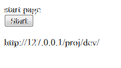

# M framework on a docker

A v1 image is now public.
run this:
```
root@Laptop:~/#  docker search mframe
NAME                DESCRIPTION                   STARS               OFFICIAL            AUTOMATED
yaweli/mframe       Mumps framewrok from yaweli   0
```

Mumps framework can run anywhere , on a docker you can shoot it on the cloud for many copies as you need this will scale you large application. 

## info:
the docker will listen to port 80 , you may map it to any port you like


After running the docker on my linux , look for the i.p. the system set to the docker.
and the url should be:
for the docker image get:
http://172.17.0.2/proj/dev/
for my linux station side:
http://172.17.0.1/proj/dev/

the first page index.html will appear:



<!--stackedit_data:
eyJoaXN0b3J5IjpbLTExNTkwNzA4ODVdfQ==
-->